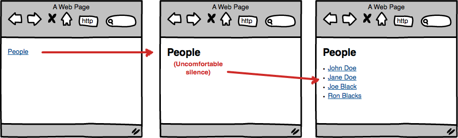
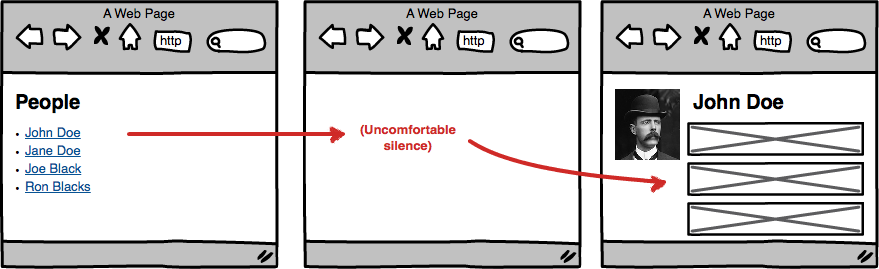

# angular-optimistic-model

> Optimistically cached models for Angular.JS.

[](https://travis-ci.org/rubenv/angular-optimistic-model)

Based on [angular-optimistic-cache](https://github.com/rubenv/angular-optimistic-cache), but concentrates on model classes.

## The problem
Usually you have something like this in your Angular.JS application:

```js
angular.module('myApp').controller('PeopleCtrl', function ($scope, $http) {
    $http.get('/api/people').then(function (result) {
        $scope.people = result.data;
    });
});
```

```html
<ul>
    <li ng-repeat="person in people">{{person.name}}</li>
</ul>
```

This simple example is a page that will fetch a list of people from the backend and shows it on a page.

Unfortunately, it suffers from the "uncomfortable silence". Here's a diagram to explain:



When you arrive on the page, it'll first show a blank page. After some time, this gets swapped with the data. Your app feels fast because navigation between screens is instant, but it feels jarring.

This is especially annoying when switching back-and-forth between pages, as it happens every time.

A similar thing happens when going from the list to a detail page:



Isn't it a bit strange that you know the name of the person on which the user clicked, but upon navigation that suddenly gets lost, forcing us to wait until all the info is loaded? Why not start out with showing the name while the rest of the data loads?

The `angular-optimistic-model` module is a very lightweight module to add some of that to your application. It's probably the least intrustive way to avoid uncomfortable silences.

## Installation
Add angular-optimistic-model to your project:

```
bower install --save angular-optimistic-model
```

Add it to your HTML file:

```html
<script src="bower_components/angular-optimistic-model/dist/angular-optimistic-model.min.js"></script>
```

Reference it as a dependency for your app module:

```js
angular.module('myApp', ['rt.optimisticmodel']);
```

## How it works

This module helps you define CRUD modules, with magic sprinkled in to avoid the uncomfortable silcences.

Each model class gets the following methods:

* `getAll`: Retrieves all objects.
* `get`: Get a specific instance.
* `getClone`: Get a specific instance, cloned.
* `create`: Create a new instance.
* `update`: Update an instance.
* `delete`: Delete an instance.

The `get`, `getClone` and `getAll` methods are cached. This works works by wrapping the promises that you wait for. The module adds a `toScope` method where you can indicate where the result should be placed on the scope.

It then does the following:

* The API call (promise) is loaded as usual, in the background.
* If it has a previously-cached value for the promise, it'll put that one on the scope.
* Once the promise is loaded, it replaces the scope value with the up-to-date data.

The end result: users see data instantly, which is updated once it's loaded.

The difference between `get` and `getClone` is that `getClone` returns a clone which you can freely modify, without affecting the cache.

## Usage

TODO


## Master / detail

The namespace is how calls are matched: when a promise is created, a cache is checked to see if a previous promise with the same namespace parameter has existed. If that's the case, the previous result is temporarily put on the scope (this avoids the uncomfortable silence).

Namespaces are structured and the module assumes that you use standard REST structures. This means that the element in `/api/people` with an `id` of `123` should map to `/api/people/123`. When a promise is resolved with an array, the cache will also be filled for children.

An example (namespace: `/api/people`):

```
[
    { id: 123, name: "Test" }
]
```

This also fills the cache of namespace `/api/people/123` with `{ id: 123, name: "Test" }`.

## Options

The options parameter is an optional object that can have the following keys (all are optional):

* `idField` (default: `id`): Which field to use for populating child caches.
* `populateChildren` (default: `true`): Whether or not to populate child caches if the promise results to an array.

## License 

    (The MIT License)

    Copyright (C) 2014 by Ruben Vermeersch <ruben@rocketeer.be>

    Permission is hereby granted, free of charge, to any person obtaining a copy
    of this software and associated documentation files (the "Software"), to deal
    in the Software without restriction, including without limitation the rights
    to use, copy, modify, merge, publish, distribute, sublicense, and/or sell
    copies of the Software, and to permit persons to whom the Software is
    furnished to do so, subject to the following conditions:

    The above copyright notice and this permission notice shall be included in
    all copies or substantial portions of the Software.

    THE SOFTWARE IS PROVIDED "AS IS", WITHOUT WARRANTY OF ANY KIND, EXPRESS OR
    IMPLIED, INCLUDING BUT NOT LIMITED TO THE WARRANTIES OF MERCHANTABILITY,
    FITNESS FOR A PARTICULAR PURPOSE AND NONINFRINGEMENT. IN NO EVENT SHALL THE
    AUTHORS OR COPYRIGHT HOLDERS BE LIABLE FOR ANY CLAIM, DAMAGES OR OTHER
    LIABILITY, WHETHER IN AN ACTION OF CONTRACT, TORT OR OTHERWISE, ARISING FROM,
    OUT OF OR IN CONNECTION WITH THE SOFTWARE OR THE USE OR OTHER DEALINGS IN
    THE SOFTWARE.
